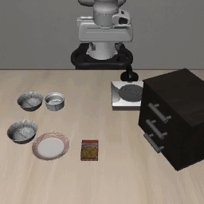
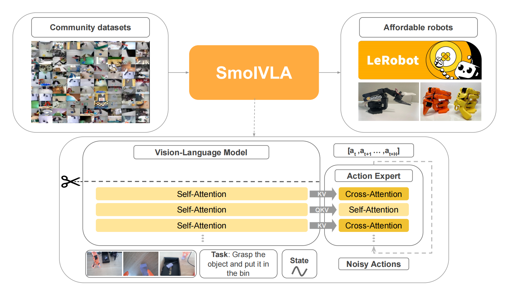

<h1 align="center">Running SmolVLA: Deployment & Evaluation</h1>

<p align="center">
  
  
  
  
  
</p>

<p align="center">
  <b>Independent deployment, training, and evaluation of Hugging Face's official SmolVLA model on Windows.</b><br>
  <em>From zero to a working VLA pipeline — with failure vs. success demos included.</em>
</p>

<p align="center">
  <a href="#demo-videos"><b> Demo Videos</b></a> •
  <a href="#architecture"><b> Architecture</b></a> •
  <a href="#windows-deployment"><b> Windows Guide</b></a> •
  <a href="#acknowledgements"><b> Acknowledgements</b></a>
</p>


<h2 id="whatisthis">1.What is this?</h2>

This repository documents my end-to-end reproduction of [SmolVLA](https://huggingface.co/lerobot/smolvla_base) — a lightweight Vision-Language-Action model released by Hugging Face.I did not re-invent the model; instead, I independently deployed, trained, and evaluated the official architecture in a constrained Windows 11 environment, overcoming real-world engineering obstacles.

The goal: understand every piece of a modern VLA pipeline, from data loading to action generation, and demonstrate that cutting‑edge robot learning can be done outside Linux clouds.

<h2 id="demo-videos">2. Demo Videos</h2>

<table align="center">
  <tr>
    <td align="center"><b>✅ Late Success</b></td>
    <td align="center"><b>❌ Early Failure</b></td>
  </tr>
  <tr>
    <td></td>
    <td></td>
  </tr>
  <tr>
    <td align="center"><i>Model successfully picks the object after convergence.</i></td>
    <td align="center"><i>Model fails to grasp — training just started.</i></td>
  </tr>
</table>

<p align="center"><b>👉 <a href="more_demos.md">More Demos (10 Tasks)</a></b></p>

<h2 id="architecture">3.Architecture</h2>

SmolVLA is a lightweight and efficient Vision-Language-Action model designed for low-cost robots, capable of training and inference on consumer-grade GPUs or even CPUs. Its core idea is to reuse the perception capabilities of a pretrained VLM but truncate its language decoding layers, using only mid-level features to condition a compact action generation head. This drastically reduces computational cost while achieving performance comparable to models 10× larger.

<p align="center">
  
</p>

<div align="center">

| Component | Role |
|-----------|------|
| **Frozen VLM (first N layers)** | Extracts visual and language features without text generation (N ≈ half of total layers) |
| **Flow Matching Action Expert** | Learns an ODE vector field that progressively denoises random noise into continuous action sequences |
| **Action Chunk Prediction** | Outputs a chunk of n low-level actions at once (e.g., 10–50 steps) for smooth control |

</div>

### Key Innovations

**1.Layer Skipping**: Uses only the first half of the VLM layers, discarding language decoding layers. This doubles inference speed with almost no performance drop.

**2.Interleaved Attention**: The action expert alternates cross-attention (attending to VLM features) and causal self-attention (attending to past actions within the chunk), balancing perception and temporal dependency.

**3.Asynchronous Inference**: Decouples action execution from perception/prediction, enabling parallel processing. This reduces task completion time by ≈30% and doubles the number of successful executions per unit time.

**4.Community Data Pretraining**: Uses only ~23k trajectories (from 481 public datasets on Hugging Face) – an order of magnitude less than models like OpenVLA – yet achieves competitive results.

### Key Statistics

<div align="center">

| Metric | Value |
|--------|-------|
| Total parameters | 0.45B (action expert ≈0.1B) |
| Training cost | ~30k GPU hours (can be trained on a single GPU) |
| Inference hardware | Consumer GPU / CPU |
| Simulation (LIBERO) | Avg. success rate 87.3% |
| Real-world (SO100) | Avg. success rate 78.3% (multi-task fine-tuned) |

</div>

> SmolVLA is fully open-sourced: model weights, training code, datasets, and robot hardware designs are available on Hugging Face.


<h2 id="windows-deployment">4.Windows Deployment</h2>


All experiments were run natively on **Windows 11** with an NVIDIA RTX 4060 (8 GB VRAM).  

No WSL2, no Docker — everything was solved through manual debugging and adaptation.

### 🔧 Environment Setup

1. **Clone repositories and dataset**
   ```bash
   git clone https://github.com/huggingface/lerobot.git
   cd lerobot
   git stash
   git checkout d602e816 # 必须要这个版本，后续版本可能会报错！
   cd ..
   git clone https://github.com/Lifelong-Robot-Learning/LIBERO # LIBERO 需要和 lerobot 为同一级
   cd lerobot
   git clone https://<你的用户名>:<你的Token>@huggingface.co/datasets/nikriz/aopoli-lv-libero_combined_no_noops_lerobot_v21
   move aopoli-lv-libero_combined_no_noops_lerobot_v21 aopoli-lv-libero
   ```

2. **Create a conda environment**
   ```bash
   conda create -n smolvla python=3.10 -c conda-forge --yes
   conda activate smolvla
   pip install torch torchvision torchaudio --index-url https://download.pytorch.org/whl/cu124
   pip install -e ".[smolvla]"
   cd ..
   cd LIBERO
   pip install -e .
   pip install robosuite==1.4.0
   pip install bddl
   pip install easydict
   pip install gym
   pip install matplotlib
   set TOKENIZERS_PARALLELISM=false # 避免 Hugging Face tokenizers 库可能产生的警告或死锁问题
   ```

3. **Download model and set path**
   ```
   cd ..
   cd lerobot
   mkdir models
   mkdir outputs
   python -c "from huggingface_hub import snapshot_download; snapshot_download('lerobot/smolvla_base', local_dir='models/smolvla_base')"
   set MODEL_ROOT=lerobot\models
   set DATA_ROOT=lerobot
   set OUTPUT_ROOT=lerobot\outputs
   ```

4. **⚠️ May meet bug**

   If you meet the error: _pickle.UnpicklingError: Weights only load failed. 

   find the file: 
   ```
   .../LIBERO/libero/libero/benchmark/__init__.py
   ```
   
### 🛠️ Challenges Overcome


<div align="center">

| Problem | Solution |
|---------|----------|
| **GPU Out‑of‑Memory** | Reduced batch size to 2; used gradient accumulation |
| **Windows path & symlink errors** | Rewrote shell commands to PowerShell equivalents; replaced `ln -s` with `New-Item` |
| **Dependency conflicts** (e.g., `gym` vs `gymnasium`, `d4rl`) | Manually pinned versions and patched import paths |
| **API changes in LeRobot** | Added missing class definitions and adjusted function calls in the source |
| **Permission errors** | Ran terminal as Administrator; modified data saving paths |

</div>


### 🚀 Training

```bash
python -m lerobot.scripts.train --policy.type=smolvla --policy.repo_id="%MODEL_ROOT%/smolvla_base" --policy.load_vlm_weights True --dataset.repo_id="%DATA_ROOT%/aopoli-lv-libero" --batch_size=32 --steps=100 --wandb.enable=false --save_freq 1000000 --output_dir="%OUTPUT_ROOT%/libero_smolvla_scratch" --job_name=quick_test --policy.push_to_hub=False  # 一行命令第一次训练

python -m lerobot.scripts.train --resume=true --config_path="%OUTPUT_ROOT%/libero_smolvla_scratch/checkpoints/000100/pretrained_model/train_config.json" --steps=自行设置  # 继续训练
```


### 🎞️ Evaluation
create file support in github: ```eval_LIBERO.py``` in ```lerobot/```

```bash
python eval_LIBERO.py --policy_path="%OUTPUT_ROOT%/libero_smolvla_scratch/checkpoints/000100/pretrained_model/"
```

Generated videos are saved to data/.


<h2 id="structure">5.This Repository Structure</h2>

```
Running_SmolVLA/
├── LICENSE
├── README.md
├── SmolVLA.pdf
├── architecture.png
├── eval_LIBERO.py
├── task8_f.gif
└── task8_s.gif
```

<h2 id="acknowledgements">6.Acknowledgements</h2>

This work would be impossible without the amazing open‑source contributions of the following projects and people:

- **[SmolVLA & LeRobot](https://huggingface.co/lerobot)** by Hugging Face — for releasing the model, codebase, and extensive documentation.
- **[LIBERO](https://github.com/Lifelong-Robot-Learning/LIBERO)** benchmark by the UT Austin Robot Perception and Learning Lab — for providing standardized simulation tasks.
- **[Datawhale’s every-embodied](https://github.com/datawhalechina/every-embodied)** tutorial — which offered a clear entry point for Chinese‑speaking learners.
- 🌍 The open‑source community on GitHub and Hugging Face for countless answered issues.


<h2 id="contact">7.📫 Contact & Links</h2>

### *Hi! I’m a freshman in **EmboideAI**, eager to learn more — feel free to reach out!*

- 🌐 **Personal website:** [hy-0003.github.io](https://hy-0003.github.io)
- 📧 **Email:** [heyi2023@lzu.edu.cn](mailto:heyi2023@lzu.edu.cn)
- 🤗 **Hugging Face model card:** [lerobot/smolvla_base](https://huggingface.co/lerobot/smolvla_base)

<p align="center">
  <sub>Built with ❤️ &nbsp;and relentless debugging on a Windows machine.</sub>
</p>
