<h1 align="center">More Demos — SmolVLA</h1>

  <b>Success & failure examples across 9 LIBERO tasks.</b> 
  <em>All videos generated during training / evaluation on Windows 11 + RTX 4060.</em>

---

<h2>Task 0</h2>
<table align="center">
  <tr>
    <td align="center"><b>✅ Success</b></td>
    <td align="center"><b>❌ Failure</b></td>
  </tr>
  <tr>
    <td></td>
    <td>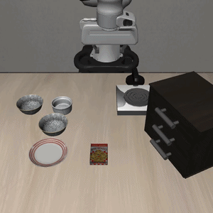</td>
  </tr>
  <tr>
    <td align="center" colspan="2"><i>Pick up the black bowl between the plate and the ramekin and place it on the plate</i></td>
  </tr>
</table>

<h2>Task 1</h2>
<table align="center">
  <tr>
    <td align="center"><b>✅ Success</b></td>
    <td align="center"><b>❌ Failure</b></td>
  </tr>
  <tr>
    <td>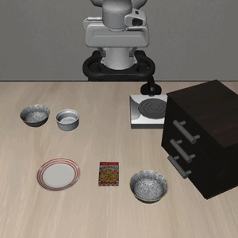</td>
    <td>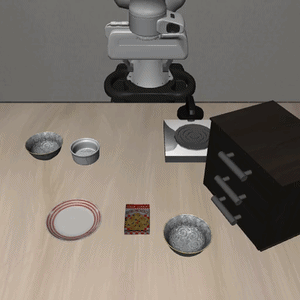</td>
  </tr>
  <tr>
    <td align="center" colspan="2"><i>Pick up the black bowl next to the ramekin and place it on the plate</i></td>
  </tr>
</table>

<h2>Task 2</h2>
<table align="center">
  <tr>
    <td align="center"><b>✅ Success</b></td>
    <td align="center"><b>❌ Failure</b></td>
  </tr>
  <tr>
    <td>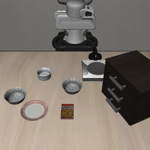</td>
    <td></td>
  </tr>
  <tr>
    <td align="center" colspan="2"><i>Pick up the black bowl from table center and place it on the plate</i></td>
  </tr>
</table>

<h2>Task 3</h2>
<table align="center">
  <tr>
    <td align="center"><b>✅ Success</b></td>
    <td align="center"><b>❌ Failure</b></td>
  </tr>
  <tr>
    <td>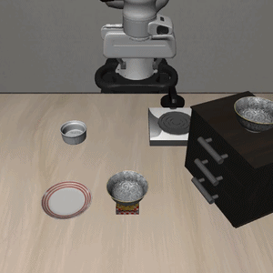</td>
    <td></td>
  </tr>
  <tr>
    <td align="center" colspan="2"><i>Pick up the black bowl on the cookie box and place it on the plate</i></td>
  </tr>
</table>

<h2>Task 4</h2>
<table align="center">
  <tr>
    <td align="center"><b>✅ Success</b></td>
    <td align="center"><b>❌ Failure</b></td>
  </tr>
  <tr>
    <td>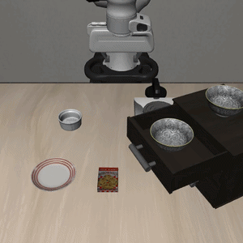</td>
    <td>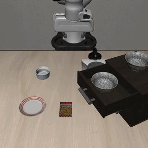</td>
  </tr>
  <tr>
    <td align="center" colspan="2"><i>Pick up the black bowlin the top drawer of the wooden cabinet and place it on the plate</i></td>
  </tr>
</table>

<h2>Task 5</h2>
<table align="center">
  <tr>
    <td align="center"><b>✅ Success</b></td>
    <td align="center"><b>❌ Failure</b></td>
  </tr>
  <tr>
    <td>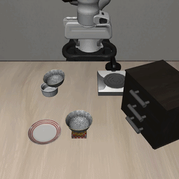</td>
    <td>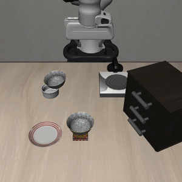</td>
  </tr>
  <tr>
    <td align="center" colspan="2"><i>Pick up the black bowl on the ramekin and place it on the plate</i></td>
  </tr>
</table>

<h2>Task 6</h2>
<table align="center">
  <tr>
    <td align="center"><b>✅ Success</b></td>
    <td align="center"><b>❌ Failure</b></td>
  </tr>
  <tr>
    <td>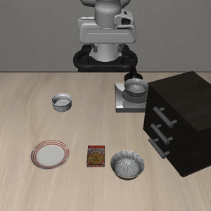</td>
    <td>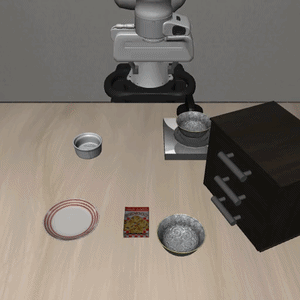</td>
  </tr>
  <tr>
    <td align="center" colspan="2"><i>Pick up the black bowl next to the cookie box and place it on the plate</i></td>
  </tr>
</table>

<h2>Task 7</h2>
<table align="center">
  <tr>
    <td align="center"><b>✅ Success</b></td>
    <td align="center"><b>❌ Failure</b></td>
  </tr>
  <tr>
    <td>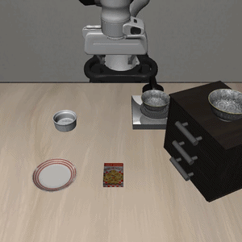</td>
    <td>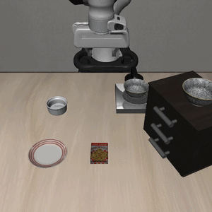</td>
  </tr>
  <tr>
    <td align="center" colspan="2"><i>Pick up the black bowl on the stove and place it on the plate</i></td>
  </tr>
</table>

<h2>Task 8</h2>
<table align="center">
  <tr>
    <td align="center"><b>✅ Success</b></td>
    <td align="center"><b>❌ Failure</b></td>
  </tr>
  <tr>
    <td></td>
    <td></td>
  </tr>
  <tr>
    <td align="center" colspan="2"><i>Pick up the black bowl next to the plate and place it on the plate</i></td>
  </tr>
</table>

<h2>Task 9</h2>
<table align="center">
  <tr>
    <td align="center"><b>✅ Success</b></td>
    <td align="center"><b>❌ Failure</b></td>
  </tr>
  <tr>
    <td>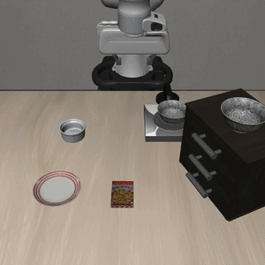</td>
    <td>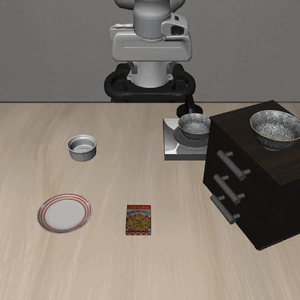</td>
  </tr>
  <tr>
    <td align="center" colspan="2"><i>Pick up the black bowl on the wooden cabinet and place it on the plate</i></td>
  </tr>
</table>

  <a href="README.md">⬅ Back to main README</a>

